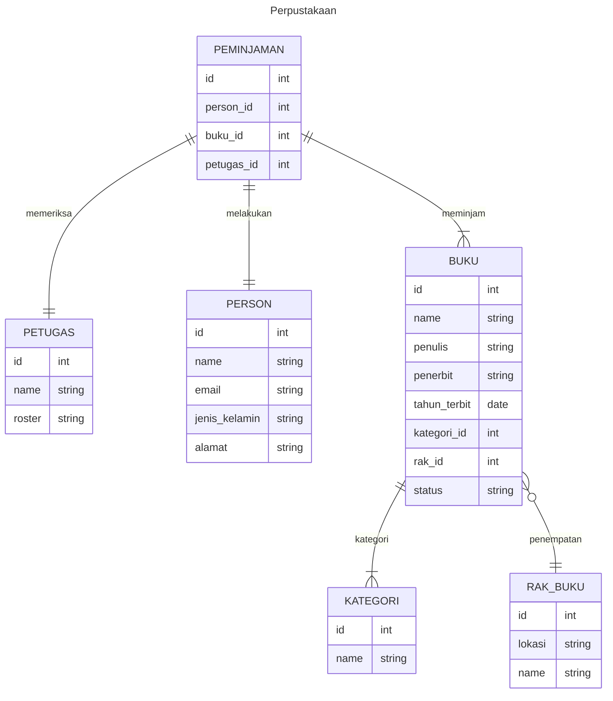

```mermaid
---
title: Perpustakaan
---
erDiagram
    KATEGORI{
        id int
        name string
    }

    RAK_BUKU{
        id int
        lokasi string
        name string
    }

    PETUGAS{
        id int
        name string
        roster string
    }

    PERSON{
        id int
        name string
        email string
        jenis_kelamin string
        alamat string
    }

    BUKU{
        id int
        name string
        penulis string
        penerbit string
        tahun_terbit date
        kategori_id int
        rak_id int
        status string
    }

    PEMINJAMAN{
        id int
        person_id int
        buku_id int
        petugas_id int
    }

    BUKU ||--|{KATEGORI:kategori
    BUKU o{--||RAK_BUKU:penempatan
    PEMINJAMAN ||--|{BUKU:meminjam
    PEMINJAMAN ||--||PERSON:melakukan
    PEMINJAMAN ||--||PETUGAS:memeriksa
```